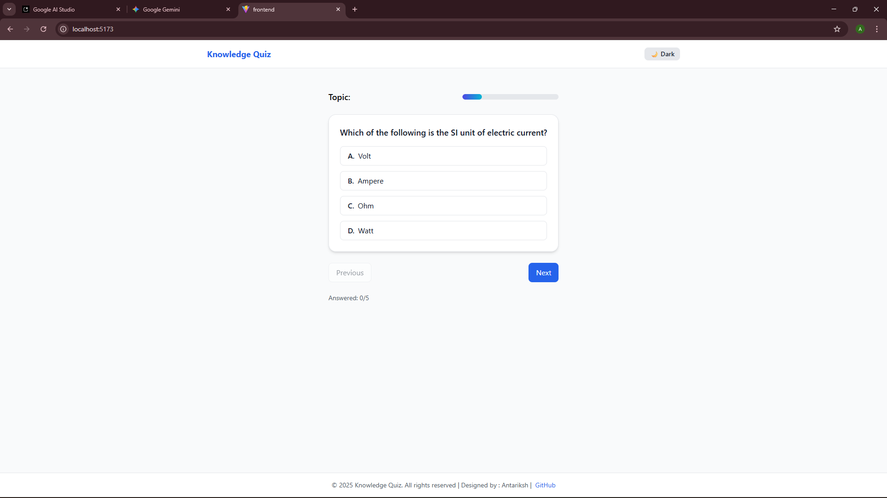

# Knowledge Quiz

[](https://ai-quiz-sage-chi.vercel.app/)

**Live Demo:** [https://ai-quiz-sage-chi.vercel.app/](https://ai-quiz-sage-chi.vercel.app/)

A modern AI-powered quiz application that generates custom quizzes on various topics using Google Gemini. Built with React (frontend) and Express (backend).

## Screenshots

| Screenshot | Description |
|------------|-------------|
|  | Topic selection interface where users choose quiz subjects |
|  | Displays loading animation while questions are being generated |
|  | Quiz interface displaying AI-generated questions and options |
|  | Results and personalized feedback after quiz completion |

## Project Structure

```
AI-quiz/
├── backend/
│   ├── .env
│   ├── package.json
│   └── server.js
├── frontend/
│   ├── .gitignore
│   ├── eslint.config.js
│   ├── index.html
│   ├── package.json
│   ├── postcss.config.js
│   ├── tailwind.config.js
│   ├── vite.config.js
│   ├── public/
│   ├── screenshots/
│   │   ├── feedback_screen.png
│   │   ├── home_screen.png
│   │   ├── loading_screen.png
│   │   └── quiz_screen.png
│   └── src/
│       ├── App.css
│       ├── App.jsx
│       ├── index.css
│       ├── main.jsx
│       ├── components/
│       │   ├── Loader.jsx
│       │   ├── ProgressBar.jsx
│       │   ├── QuestionCard.jsx
│       │   └── ThemeToggle.jsx
│       ├── pages/
│       │   ├── QuizGeneration.jsx
│       │   ├── QuizPlay.jsx
│       │   ├── Results.jsx
│       │   └── TopicSelect.jsx
│       └── services/
│           └── aiService.js
├── README.md
└── ...
```

## Features

- **AI-Generated Quizzes:** Instantly generate 5-question MCQ quizzes on selected topics.
- **Real-Time Feedback:** Receive personalized, encouraging feedback based on your score.
- **Modern UI:** Responsive, accessible, and themeable interface (light/dark mode).
- **Smooth Animations:** Seamless transitions and progress indicators.
- **Easy to Extend:** Add new topics or enhance quiz logic easily.

## Tech Stack

- **Frontend:** React, Vite, Tailwind CSS, Framer Motion
- **Backend:** Node.js, Express, Google Generative AI (Gemini)
- **Other:** ESLint, PostCSS, dotenv

## Getting Started

### Prerequisites

- Node.js (v18+ recommended)
- npm

### Setup

#### 1. Clone the repository

```sh
git clone https://github.com/antariksh101/AI-quiz.git
cd AI-quiz
```

#### 2. Backend Setup

```sh
cd backend
npm install
# Create a .env file with your Gemini API key:
echo "GEMINI_API_KEY=your_gemini_api_key" > .env
echo "PORT=5000" >> .env
npm run dev
```

#### 3. Frontend Setup

Open a new terminal:

```sh
cd frontend
npm install
npm run dev
```

The frontend will be available at [http://localhost:5173](http://localhost:5173) and the backend at [http://localhost:5000](http://localhost:5000).


## Usage

1. Select a quiz topic or enter a custom topic.
2. Wait for the AI to generate your quiz.
3. Answer the questions.
4. View your score and receive AI-generated feedback.
5. Restart or try a new topic!

## Customization

- **Add Topics:** Edit the `TOPICS` array in [`frontend/src/pages/TopicSelect.jsx`](frontend/src/pages/TopicSelect.jsx).
- **Styling:** Modify Tailwind classes or add custom CSS in [`frontend/src/App.css`](frontend/src/App.css).
- **Quiz Logic:** Update backend logic in [`backend/server.js`](backend/server.js).

## License

This project is licensed under the MIT License.

## Credits

- Designed & developed by [Antariksh](https://github.com/antariksh101)
- Powered by [Google Generative AI](https://ai.google.dev/)

---

> © 2025 Knowledge Quiz. All rights reserved.
